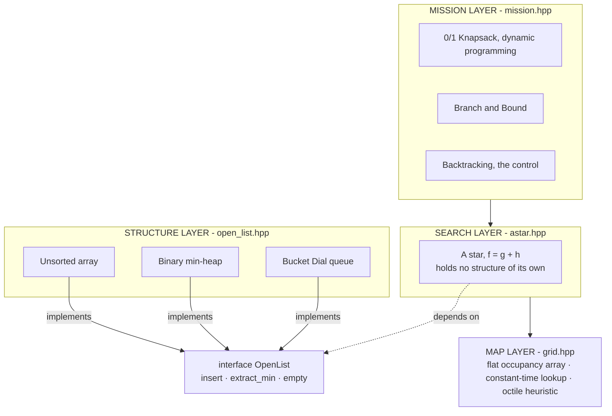
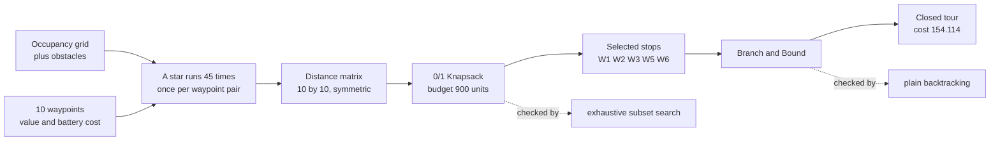
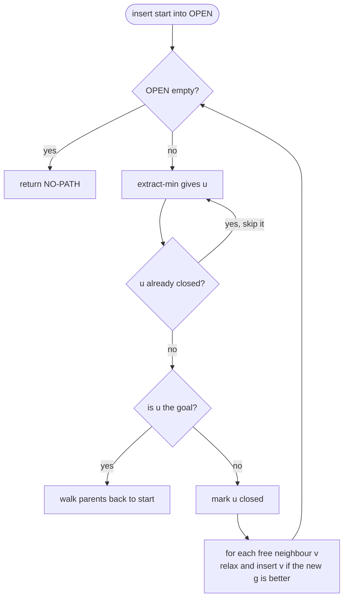
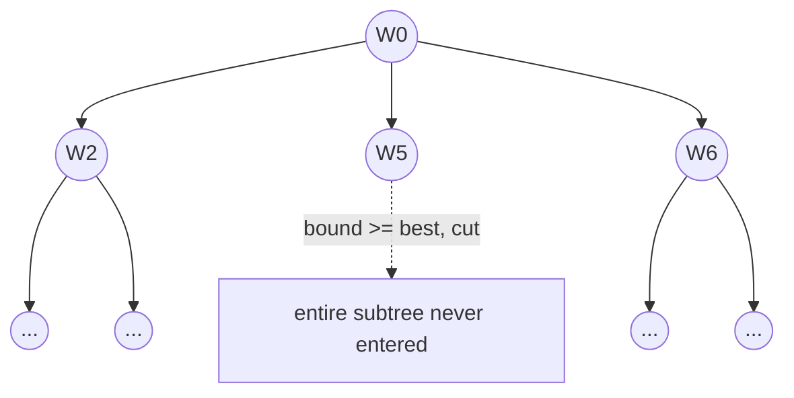

# Design Book

**Grid-Based Drone Path Planning Simulation**
DSA-II (CCSE0301) · Review 2 · Month 2

Aditya Upadhyay · 2501330100038 · B.Tech CSE-A, Semester III · NIET Greater Noida
Faculty: Mr. Shamshad Ali · SDG 9

How the planner is put together: the layers, the algorithms in pseudocode, the flow of
control through each one, and the screens it prints. Written so the logic can be followed
without opening the source.

---

## Contents

1. [System layers](#1-system-layers)
2. [Data flow](#2-data-flow)
3. [The swap point](#3-the-swap-point)
4. [Map and cost model](#4-map-and-cost-model)
5. [A\* search](#5-a-search)
6. [The three OPEN lists](#6-the-three-open-lists)
7. [Waypoint selection](#7-waypoint-selection)
8. [Visiting order](#8-visiting-order)
9. [Screen wireframes](#9-screen-wireframes)
10. [Complexity summary](#10-complexity-summary)
11. [Test plan](#11-test-plan)

---

## 1. System layers

Four layers, each depending only on the one below it. The arrow that matters is the dashed
one: A\* points at the `OpenList` interface, never at a concrete structure. That single
indirection is what makes the whole comparison valid, because swapping the structure cannot
change a line of the search.



**Figure 1 — Dependency direction.** A\* is compiled against the interface only. The three
structures implement it and are chosen at run time, so the search instructions executed are
byte-for-byte identical whichever one is in use. Any difference in measured time therefore
belongs to the structure.

---

## 2. Data flow

One mission, start to finish. A\* runs many times before either mission algorithm runs once,
which is the part worth noticing: the distance matrix is not input data, it is computed by
forty-five separate searches.



**Figure 2 — One mission end to end.** Forty-five A\* runs build the 10 × 10 matrix. The
knapsack reads battery costs from it and returns five stops; branch and bound reads the same
matrix and orders them. The two brute-force verifiers run on the same inputs but outside the
timed region.

---

## 3. The swap point

The whole project exists to answer one question the base paper leaves open, so the mechanism
that isolates the variable deserves its own picture.

```
                   +------------------------------------------+
                   |          A* body — unchanged             |
                   |      same source, same -O2 build         |
                   +--------------------+---------------------+
                                        |
                           +------------v------------+
                           |     OpenList socket     |
                           +------------+------------+
                                        |
        +-------------------------------+-------------------------------+
        |                               |                               |
+-------v---------+           +---------v---------+           +---------v----------+
| Unsorted array  |           |  Binary min-heap  |           | Bucket (Dial) queue|
| O(n) pop        |           |  O(log n) pop     |           | O(1) pop           |
| 3.421 ms        |           |  0.244 ms         |           | 0.144 ms           |
+-----------------+           +-------------------+           +--------------------+
            exactly one is plugged in per run
```

**Figure 3 — What is held fixed and what varies.** Times are medians at 128 × 128 with 20%
obstacle density. All three return the same route cost on all fifty test maps, so the spread
is purely the cost of choosing the minimum.

---

## 4. Map and cost model

The map is one flat `vector<bool>` of `W × H` cells. A cell is addressed by `id = y*W + x`,
so a lookup is two integer operations and no pointer chasing. About 100,000 lookups happen
per plan, which is the reason the map itself uses no tree.

Costs are scaled to integers so that comparisons are exact and the bucket queue becomes legal
in the first place:

- straight step = `1000`
- diagonal step = `1414` (√2 × 1000, truncated)

### OCTILE-HEURISTIC(a, b) — O(1), admissible and consistent

```
// Straight-line distance is admissible but loose on an 8-neighbour grid.
// Octile is the exact cost of crossing open ground, so it never overestimates
// and never underestimates by more than the obstacles force.

dx <- |x(a) - x(b)|
dy <- |y(a) - y(b)|
lo <- min(dx, dy)
hi <- max(dx, dy)
return 1414*lo + 1000*(hi - lo)
```

> **Why it must be consistent.** A consistent heuristic guarantees that a cell's `f` value
> never decreases along a path. The bucket queue relies on that property for its window size,
> and lazy deletion in A\* relies on it for correctness. An inadmissible heuristic would break
> both at once.

---

## 5. A\* search

### ASTAR(grid, start, goal, OPEN) — O(E) pops, structure decides the constant

```
g[.] <- INF ;  parent[.] <- -1 ;  closed[.] <- false
g[start] <- 0
OPEN.insert(start, h(start, goal))

while not OPEN.empty() do
    u <- OPEN.extract_min()
    if closed[u] then continue          // lazy deletion
    closed[u] <- true
    if u = goal then return RECOVER(parent, goal)

    for each v in NEIGHBOURS(u) do      // up to 8
        if blocked(v) or closed[v] then continue
        c  <- diagonal(u,v) ? 1414 : 1000
        ng <- g[u] + c
        if ng < g[v] then
            g[v] <- ng
            parent[v] <- u
            OPEN.insert(v, ng + h(v, goal))

return NO-PATH
```

There is no decrease-key operation. A better `g` simply inserts the cell again, and the stale
copy is skipped when it surfaces because `closed[u]` is already set. This is sound only
because the heuristic is consistent, and it is what lets all three structures share one
minimal interface.



**Figure 4 — A\* control flow.** The `closed[u]` branch back to `extract_min` is lazy
deletion. A stale duplicate of an already-closed cell costs one pop and is discarded, which is
cheaper than maintaining a decrease-key index in every structure.

---

## 6. The three OPEN lists

All three satisfy the same three-method contract. Only the body changes.

### UNSORTED-ARRAY — the baseline (insert O(1), extract O(n))

```
insert(cell, f):      append (cell, f) to the back
extract_min():        scan every entry, remember the smallest f,
                      swap it with the back, pop the back
```

### BINARY-MIN-HEAP (insert O(log n), extract O(log n))

```
insert(cell, f):
    append to the back
    while node < parent:  swap, move up          // sift-up

extract_min():
    root <- a[0]
    a[0] <- last element, shrink by one
    while node > smaller child:  swap, move down // sift-down
    return root

// Stored as a flat array: children of i are 2i+1 and 2i+2.
// No node objects, no pointers, so the whole frontier stays cache-resident.
```

### BUCKET (DIAL) QUEUE (insert O(1), extract O(1) amortised)

```
SPAN <- 2 * 1414 + 1                // see the derivation below
buckets[0 .. SPAN-1] <- empty lists
scan <- -1

insert(cell, f):
    b <- f mod SPAN
    push cell onto buckets[b]
    if scan < 0 then scan <- b

extract_min():
    while buckets[scan] is empty:  scan <- (scan + 1) mod SPAN
    return pop back of buckets[scan]
```

> **The window must be 2C+1, not C+1.**
>
> Dijkstra's bound says a successor key exceeds the current minimum by at most one edge cost,
> so `C+1` buckets suffice. A\* is different. For a successor `v` of `u`:
>
> ```
> f(v) = g(u) + c + h(v) = f(u) - h(u) + c + h(v)
> ```
>
> Consistency gives `h(v) - h(u) <= c`, so `f(v) <= f(u) + 2c`. The spread is twice as wide,
> and sizing at `C+1` makes distant keys alias onto occupied buckets. The queue then returns
> cells out of order and the route is no longer optimal. This was a real defect in the first
> version: it returned cost 43006 where the heap returned 41592 on the same map, and only the
> cross-structure test caught it.

---

## 7. Waypoint selection

The drone cannot serve every delivery on one battery. Each waypoint carries a value and a
battery cost; the task is to pick the subset of greatest total value that fits the budget.
A waypoint cannot be half visited, so this is 0/1 and not fractional, and the greedy
value-per-unit argument does not hold.

### KNAPSACK-SELECT(waypoints, budget) — O(n × W) time and table space

```
for i <- 0 to n:  dp[i][0] <- 0
for w <- 0 to W:  dp[0][w] <- 0

for i <- 1 to n do
    for w <- 0 to W do
        skip <- dp[i-1][w]
        if cost[i] <= w then
            take <- dp[i-1][w - cost[i]] + value[i]
            dp[i][w] <- max(skip, take)
        else
            dp[i][w] <- skip

// Traceback: walk the last column upward and ask, at each row,
// whether the value changed. If it did, item i was taken.
w <- W ;  chosen <- {}
for i <- n down to 1 do
    if dp[i][w] != dp[i-1][w] then
        chosen <- chosen + {i}
        w <- w - cost[i]
return reverse(chosen), dp[n][W]
```

Each cell reads exactly two cells from the row above:

```
                w - cost[i]                      w
                    |                            |
  row i-1      +---------+                  +---------+
               |  take   |                  |  skip   |
               +----+----+                  +----+----+
                    \                            |
                     \                           |
                      \                          v
  row i                 ------------------> +---------+
                                            | max of  |
                                            | the two |
                                            +---------+

  traceback: start at dp[n][W] and walk up; wherever the value
  changed between row i and row i-1, item i was taken.
```

**Figure 5 — Filling the table, then reading the answer out of it.** The table alone gives the
best *value*; the subset itself only comes from walking back up through it.

> **Measured, including where it loses.** The table costs `O(n × W)` whatever `n` is, so at
> small input sizes exhaustive subset search wins outright. The crossover is at **14 items**.
> At 22 items the table runs in 0.034 ms against 201.42 ms. Reporting only the favourable size
> would have hidden half the story, so the sweep reports every size from 8 to 24.

---

## 8. Visiting order

Once the stops are chosen, the order they are served in decides the distance flown. Plain
backtracking walks every permutation. Branch and bound walks the same tree but refuses to
enter a branch whose best possible completion already costs more than the best full tour
found so far.

### BOUND(cost_so_far) — O(n), must never overestimate

```
b <- cost_so_far
for each stop i not yet visited do
    b <- b + cheapest_outgoing_edge[i]
return b

// Any real completion must leave every unvisited stop along some edge,
// and no edge is cheaper than that stop's cheapest one. So b can never
// exceed the true completion cost. A bound that could overestimate
// would prune the optimum and return a worse tour, silently.
```

### TSP-BRANCH-AND-BOUND(depot) — O(n!) worst case, pruned in practice

```
best <- INF
visit(depot) ; RECURSE(depot, depot, depth = 1, cost = 0)

RECURSE(depot, at, depth, cost):
    nodes_explored <- nodes_explored + 1

    if depth = n then                       // tour complete, close it
        total <- cost + d[at][depot]
        if total < best then best <- total ; best_order <- path
        return

    for each unvisited next do
        step <- cost + d[at][next]
        mark next visited ; push next onto path
        if BOUND(step) < best then          // <-- the only line that differs
            RECURSE(depot, next, depth + 1, step)
        else
            nodes_pruned <- nodes_pruned + 1
        pop path ; unmark next
```

Deleting that one marked test turns the procedure into plain backtracking, which is exactly
how the control is implemented. Both return the identical optimal tour at every size tested;
only the amount of tree searched differs.



**Figure 6 — Where the bound saves work.** A cut removes an entire subtree, not one node,
which is why the saving compounds with depth.

| stops | backtracking nodes | B&B nodes | avoided |
|---|---:|---:|---:|
| 5 | 65 | 52 | 20.0% |
| 7 | 1,957 | 601 | 69.3% |
| 9 | 109,601 | 2,677 | 97.6% |
| 11 | 9,864,101 | 70,590 | 99.3% |

Below about seven stops the bound costs more to compute than it saves and plain backtracking
is faster; that crossover is reported rather than hidden.

---

## 9. Screen wireframes

There is no graphical interface. The program is four executables that print to a terminal, and
the layout of that output is the interface, so it is designed rather than left to chance: a
banner, then one labelled block per stage, with the verifier's verdict on the same screen as
the result it checks.

```console
$ ./mission
================================================
 Mission planning: A* feeds selection, then ordering
================================================

SEARCH    A* builds the distance matrix
  10 waypoints, 45 A* runs, 0.9 ms

KNAPSACK  0/1 selection: which stops to serve
  battery budget  : 900 units
  selected        : W1 W2 W3 W5 W6
  total value     : 315
  battery used    : 890 of 900
  DP table cells  : 9911
  brute force     : value 315 over 1024 subsets, 0.04 ms
  agreement       : YES, DP matches the exhaustive answer

ORDERING  Travelling Salesman over the 6 selected stops
  backtracking    : cost 154.114   nodes      326   0.01 ms
  branch & bound  : cost 154.114   nodes      217   0.01 ms
  same optimum    : YES, pruning is safe
  nodes avoided   : 33.4%
  visiting order  : W0 W2 W3 W1 W5 W6 -> W0 (return to depot)
```

```console
$ ./tests
Test 2: all three structures agree on 50 random maps
  [PASS] all three agree on reachability
  [PASS] all three return the same optimal cost

Test 6: bucket queue matches heap ordering
  [PASS] identical optimal cost
       heap: cost=41592 exp=62 | bucket: cost=41592 exp=32
       (tie-breaking differs by 48%)

ALL TESTS PASSED (0 failures)
```

```console
$ ./scaling
KNAPSACK  DP table against exhaustive subset search

  items      DP cells      subsets      ratio     brute ms      DP ms
  ---------------------------------------------------------------------
  12            11713         4096       0.3x      0.2319      0.011
  14            13515        16384       1.2x      0.6502      0.018   <- crossover
  16            15317        65536       4.3x      2.7423      0.014
  22            20723      4194304     202.4x      201.42      0.034
```

Three design rules hold across all of them. A measured number never appears without the unit
it was measured in. A claim and its check sit adjacent, so `agreement : YES` is never more than
a line away from the value it confirms. And the crossover row is marked rather than omitted.

---

## 10. Complexity summary

| Component | Operation | Best | Worst | Space | Verdict |
|---|---|---|---|---|---|
| Occupancy grid | cell lookup | O(1) | O(1) | O(W·H) bits | kept |
| Unsorted array | extract-min | O(1) insert | O(n) | O(n) | baseline only |
| Binary min-heap | extract-min | O(1) peek | O(log n) | O(n) | kept |
| Bucket queue | extract-min | O(1) | O(1) amort. | O(n + 2C) | **fastest** |
| A\* over the grid | full plan | O(E) | exponential | O(V) | kept |
| Adjacency matrix | edge lookup | O(1) | O(1) | O(V²) ≈ 4.29 GB | rejected |
| Binary search tree | extract-min | O(log n) | O(n) | O(n) | rejected |
| 0/1 Knapsack | fill + traceback | O(n·W) | O(n·W) | O(n·W) | kept |
| Backtracking TSP | full search | O(n!) | O(n!) | O(n) | control |
| Branch and Bound | pruned search | depends | O(n!) | O(n) | **kept** |

The adjacency matrix figure is for a 256 × 256 grid: 65,536 vertices, so 65,536² entries,
against roughly 0.5 MB for the adjacency list. That is the single clearest reason the grid is
never materialised as an explicit graph.

---

## 11. Test plan

Six tests, and one of them is load-bearing. Test 2 is the only one that could have caught the
bucket-queue window bug, because a single-structure test has nothing to disagree with.

| # | What it checks | Why it exists |
|---|---|---|
| 1 | Empty 10×10 grid, corner to corner | Cost must be exactly nine diagonal steps, 12726. A hand-computable answer anchors the cost model. |
| 2 | All three structures over 50 random maps | **Cross-check.** Any disagreement on route cost means a structure is returning cells out of order. This is the test that failed on the C+1 window. |
| 3 | A solid wall admits no path | Obstacles are respected and the search terminates instead of looping. |
| 4 | A wall with a gap is routed through | The returned path contains no blocked cell, checked cell by cell. |
| 5 | Heap invariant under mixed operations | Extract-min returns keys in sorted order after interleaved inserts. |
| 6 | Bucket and heap on one map | Same optimal cost, different expansion counts. The difference is tie-breaking, not error, so the test asserts cost and reports the gap. |

> **A prediction that turned out wrong.** The design argued that insertions outnumber
> extractions roughly 8 to 1, since each expansion generates up to eight neighbours, and used
> that to favour structures with cheap insertion. Measured on a 256 × 256 grid the ratio is
> **1.20 to 1**: most neighbours are rejected before insertion because they are already closed,
> blocked, or no improvement. The original claim is corrected in place rather than deleted,
> because the reasoning behind it is still worth seeing.

---

Design book · Review 2 · Month 2 · built against g++ 13.3.0, C++17, `-O2 -Wall -Wextra`

Timings are medians on one machine; ratios hold across machines, absolute milliseconds do not.
