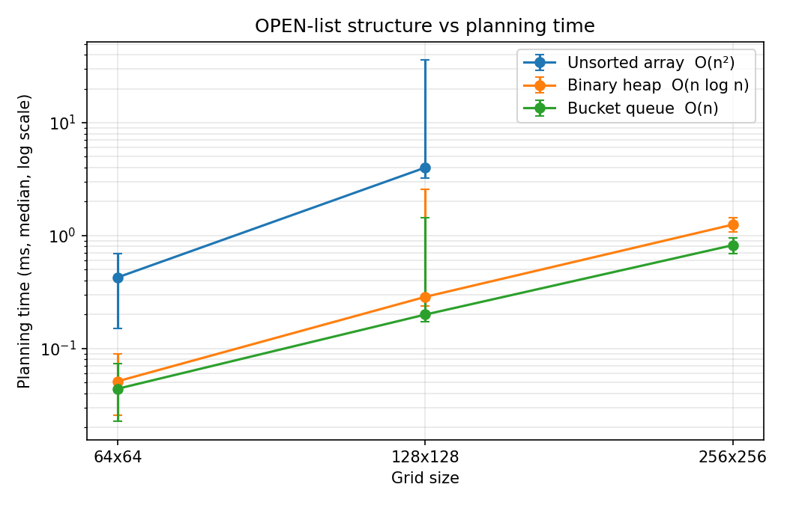

# Grid-Based Drone Path Planning Simulation

DSA-II individual project. B.Tech CSE, 3rd semester, NIET Greater Noida.

A drone crosses a map of square cells and reaches its goal without flying through anything blocked. What this project actually measures is one level below that: how much of a planner's speed comes from the data structure holding its frontier, rather than from the algorithm on top.

## The gap this addresses

My base paper is [Gao, Li and Pang (2026)](https://doi.org/10.1038/s41598-026-45160-6), *Scientific Reports* 16:18275. They report a 46.2 per cent cut in computation time for an A\*-APF planner.

Every result in that paper is a time in seconds. But the paper describes its OPEN list only in words — "the node with the lowest cost is selected for expansion" — and never says what structure holds it. Picking the minimum costs O(n) from an array, O(log n) from a heap, or O(1) from a bucket queue. So part of any reported speed could be coming from the structure, and there is no way to tell from the paper.

This project holds A\* fixed and swaps only the OPEN list.

## Build and run

```bash
make            # builds planner and tests
make test       # correctness suite
make bench      # writes results.csv
python3 scripts/plot.py    # charts from the CSV
```

Requires g++ with C++17. Built with `-O2` — comparing an unoptimised build against an optimised one gives a meaningless result, so the flag is fixed in the Makefile and quoted in the report.

## What makes the comparison valid

Everything hangs on one interface:

```cpp
class OpenList {
    virtual void insert(int cell, int f) = 0;
    virtual int  extract_min()           = 0;
    virtual bool empty() const           = 0;
};
```

A\* calls these three and knows nothing about what sits behind them. Swapping the implementation changes no line of the search, so a runtime difference is attributable to the structure and not to two different programs.

Three implementations:

| Class | Insert | Extract-min | Whole search |
|---|---|---|---|
| `UnsortedArrayOpenList` | O(1) | O(n) | O(n²) |
| `BinaryHeapOpenList` | O(log n) | O(log n) | O(n log n) |
| `BucketQueueOpenList` | O(1) | O(1) amortised | O(n) |

The bucket queue works because of a property of grids that general graph algorithms cannot assume: edge weights take exactly two values, 1000 and 1414 after integer scaling. All f-values lie on a bounded integer lattice, and under a consistent heuristic A\* expands in non-decreasing f order, so live keys stay inside a fixed window. Those are Dial's preconditions.

## Results

20% obstacle density, 10 maps per configuration, 5 repetitions each, cold run discarded, medians reported.

| Structure | 64×64 | 128×128 | 256×256 |
|---|---|---|---|
| Unsorted array | 0.427 ms | 4.005 ms | — |
| Binary heap | 0.051 ms | 0.286 ms | 1.251 ms |
| Bucket queue | 0.044 ms | 0.200 ms | 0.822 ms |

**Speedup over the array baseline:** 8.3× at 64², rising to **14× (heap)** and **20× (bucket)** at 128². The gap widens with size, which is what O(n²) against O(n log n) predicts.

**Scaling when the grid doubles** (4× the cells):

| Structure | 64→128 | 128→256 | Expected |
|---|---|---|---|
| Unsorted array | 9.4× | — | super-linear, O(n²) |
| Binary heap | 5.6× | 4.4× | ~4× plus a log factor |
| Bucket queue | 4.5× | 4.1× | ~4×, linear |

The bucket queue tracks 4× almost exactly. That is the log factor disappearing, visible in measurement.

**Bucket vs heap:** 14% faster at 64², 30% at 128², 34% at 256².



## Two findings I did not expect

**Tie-breaking matters more than I assumed.** On the same map the heap expanded 62 nodes and the bucket queue 32 — a 48% difference with identical path cost. Both are correct. They differ because the bucket queue pops LIFO within a bucket, which biases exploration toward recently discovered cells and therefore toward the goal. Tie-breaking deserves treating as a factor in its own right, not a detail.

**My insert-to-extract estimate was wrong.** I had assumed roughly 8:1, since each expansion generates up to 8 neighbours. Measured it is **1.20:1**. Most neighbours are rejected before insertion — already closed, blocked, or not an improvement on a known `g`. The argument for favouring cheap insertion is therefore much weaker than I wrote in the report, and that section needs correcting.

## A bug the tests caught

The first bucket queue used `C + 1` buckets, taking the Dijkstra bound where a successor key exceeds the current minimum by at most one edge cost. It returned suboptimal paths: 43006 against the heap's 41592 on the same map.

For A\* with a consistent heuristic the bound is twice that:

```
f_v = g_u + c + h_v = f_u − h_u + c + h_v,   and  h_v − h_u ≤ c
⇒ f_v ≤ f_u + 2c
```

At `C + 1` the distant keys aliased onto occupied buckets and cells came out in the wrong order. Fixed to `2C + 1`. Found only because the test suite checks that all three structures return the same cost on 50 random maps — no single-structure test would have caught it.

## Tests

```
Test 1  empty grid, corner to corner: cost is exactly 9 diagonal steps (12726)
Test 2  all three structures agree on cost across 50 random maps
Test 3  no path through a solid wall
Test 4  wall with a gap is routed around, path contains no blocked cell
Test 5  heap extract-min returns 7,8,9,11,12,14 in order
Test 6  bucket queue matches heap cost; expansion difference reported
```

## Layout

```
include/grid.hpp        occupancy grid, integer costs, octile heuristic
include/open_list.hpp   the interface and all three implementations
include/astar.hpp       the search, depends only on the interface
src/main.cpp            benchmark runner, writes CSV
src/test.cpp            correctness suite
scripts/plot.py         charts from the CSV
```

## Why C++ and not Python

The claim is that data-structure choice shows up in measured time. In Python every `int` is a boxed heap object, so an array is an array of pointers scattered across memory — the cache-locality advantage that makes a flat heap beat a pointer structure becomes unmeasurable. Interpreter overhead of 50–100× per operation would swamp the constant factors being isolated. The result would measure the interpreter, not the structures.

Python is used only in `scripts/plot.py`, which reads the CSV after the fact and never touches the measured path.

## Status

Review 2 work. Review 1 was research and design with nothing implemented; that is now done for the array, heap and bucket queue. Still ahead: the 4-ary heap variant, MovingAI benchmark maps instead of random ones, obstacle-density sweeps, and the Unit 5 comparison against binomial and Fibonacci heaps.

## Me

Aditya Upadhyay
Roll no. 2501330100038, CSE-A, 3rd sem, NIET Greater Noida
Faculty: Mr. Shamshad Ali
SDG 9 — Industry, Innovation and Infrastructure
